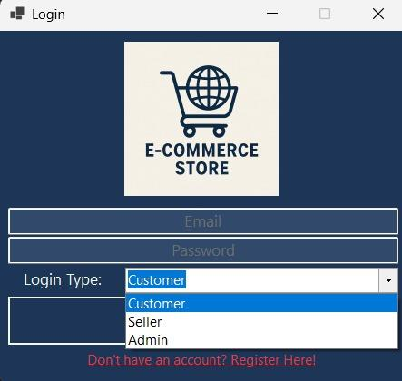
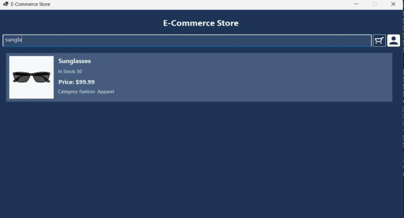

# E-Commerce Store

## 📘 Project Description

This project is a **full-stack e-commerce platform** developed as part of the **CSE244 Database Systems** course. It showcases a fully functional online store with integrated **database design**, **SQL queries**, and a **graphical user interface (GUI)** tailored for three main user roles: **Customer**, **Seller**, and **Admin**.

The system allows:

* **Customers** to browse, search, and purchase products, manage their profiles, save payment methods and addresses, and track past orders.
* **Sellers** to add, edit, and manage their own products with real-time visibility in the store.
* **Admins** to oversee the platform by managing products, categories, sellers, and users.

On the backend, a robust **SQL Server database schema** supports all operations. The schema features relational integrity, well-structured stored procedures, and functions to handle real-world commerce operations like cart management, order processing, and inventory updates.

This project demonstrates a strong understanding of:

* **Relational database design**
* **SQL programming (queries, procedures, functions)**
* **Entity relationships and constraints**
* **User interface design and interaction flows**
* **Real-world e-commerce logic**

It serves as a practical model of a real-life online retail application and offers a scalable foundation for future enhancements like delivery tracking, user analytics, and dynamic recommendations.

## 🔐 Authentication Pages
### Register Page

### Login Page

## 👤 Customer View
### Product Listing

### Single Product View

### Product Search

### Shopping Cart

### Order Processing

## 🏪 Admin/Seller Sections
### Admin Products View

### Add New Category (Admin)

### Add New Product (Seller)

